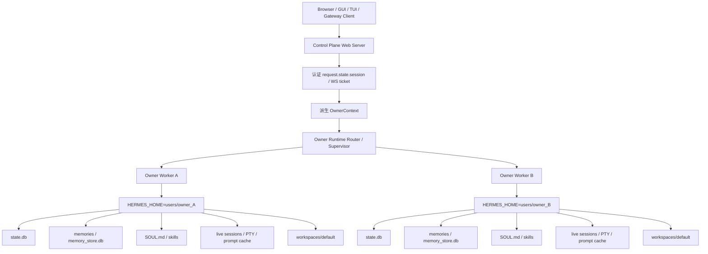
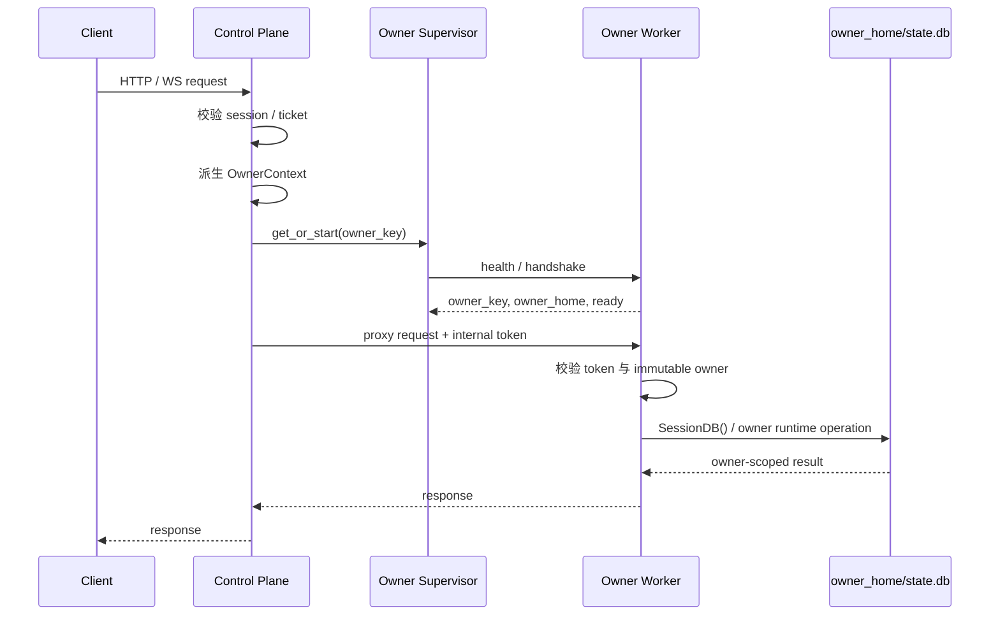

# Hermes 多用户隔离彻底方案：Control Plane + Owner Runtime Worker

> 更新时间：2026-07-08  
> 状态：架构重整版  
> 目标：启用 Dashboard 认证后，以**当前登录用户 owner** 作为运行时隔离边界；通过 Control Plane / Owner Runtime Plane 分离，避免 session、live runtime、memory、SOUL、skills、PTY/browser、workspace、prompt cache 等状态跨用户串用。

## 0. 执行摘要

本方案不再把“在共享进程里到处传 `owner_key`”作为最终架构，而是把 owner 提升为**运行时边界**：

```text
Control Plane Web Server
  只负责认证、owner 派生、票据签发、请求路由、worker 生命周期管理；
  不直接处理 authenticated owner 的 session DB、live state、PTY、memory、skills、prompt。

Owner Runtime Worker
  一个 worker 只服务一个 owner；
  进程启动时固定 HERMES_HOME=<global HERMES_HOME>/users/<owner_key>；
  所有 owner-sensitive 操作都在该 worker 内完成。
```

核心决策：

1. authenticated 用户拥有独立 data root：`<global HERMES_HOME>/users/<owner_key>/`；
2. authenticated 用户拥有独立 worker process：`owner_key -> Owner Runtime Worker`；
3. worker 必须是**独立 OS 进程**；不能在同一 Python 进程内通过 ContextVar、临时修改 `os.environ` 或传 `owner_key` 来服务多个 owner；
4. worker 进程环境在启动时固定：`HERMES_HOME=<owner_home>`，并携带不可变 owner metadata；
5. authenticated Web API / WS 请求先由 Control Plane 校验登录态并派生 `OwnerContext`，再路由到对应 owner worker；
6. Control Plane 不直接打开 authenticated owner 的 `SessionDB`，不维护 owner-sensitive live state；
7. live session、active slot、PTY browser session、prompt cache、skills cache、memory cache、`sessions.json`、channel directory、mirror lookup 等进程内/运行时索引都留在 owner worker 内；
8. local / unauthenticated 模式可以保留现有 legacy 行为，但不能和 authenticated owner runtime 混用；
9. owner scope 外的数据对当前 owner 表现为“不存在”，不暴露“存在但无权限”；
10. 迁移期禁止“半隔离”上线：只在认证层/前端加入 `owner_key`，但仍让 Control Plane 处理 DB、live、resume、PTY 的形态，安全上等同未完成。

这条路线把风险面从：

```text
每个函数、每个 helper、每个 cache、每个 map 都必须记得 owner-aware
```

收敛为：

```text
只有 Control Plane 的认证/路由边界必须 owner-aware；
Owner Worker 内部默认只能看到自己的 HERMES_HOME、state.db、live state、workspace。
```

## 1. 安全目标与非目标

### 1.1 安全目标

启用 Dashboard 认证后保证：

- A/B 用户的 session list/detail/search/export/patch/delete/prune 完全隔离；
- GUI Chat / TUI / Gateway resume 不能恢复其他 owner 的历史 session 或 live session；
- live session、active session slot、PTY browser session、browser bridge 不能跨 owner 复用或互踢；
- memory、SOUL、skills、system prompt、prompt snapshot、agent cache 不串用户；
- authenticated runtime 的 `HERMES_HOME`、subprocess env、runtime files、logs、checkpoint、restart marker 都在 owner scope 下；
- authenticated cwd / workspace 不能加载其他 owner 项目中的 `CLAUDE.md` / memory / context；
- 前端 `owner_key` 只用于本地分桶，不参与后端授权；
- owner 上下文缺失或不一致时 fail closed，不 fallback 到全局 home。

### 1.2 非目标

本方案不把以下内容作为第一目标：

- 共享 `state.db` 下完整 row-level owner 隔离；
- admin / 组织级审计 / 跨用户统计；
- legacy session claim / 自动迁移工具；
- shared workspace ACL；
- frontend 所有 UI preference localStorage 全面隔离；
- 跨 owner 全局搜索。

如后续需要 admin / audit 能力，应单独设计 Admin Plane，而不是让普通 Control Plane 直接绕过 owner worker 读取所有 owner 数据。

### 1.3 迁移与兼容声明

启用 authenticated owner runtime 后，第一版语义建议明确为：

- authenticated 用户默认进入新的 owner home，不自动读取 legacy/global `state.db`；
- local / unauthenticated 模式继续使用 legacy home/profile 行为；
- legacy 数据导入、claim、合并、回滚作为独立迁移工具设计，不混入普通请求路径；
- owner secret 是 owner_key 稳定性的根，必须持久化和备份；secret 丢失或误轮换会表现为“同一用户进入新 owner home”；
- 产品层需接受：上线 authenticated 隔离后，老的 local/global 会话不会自动出现在登录用户的 owner 视图中，除非后续显式导入。

### 1.4 Profile 与 Owner 的关系

现有代码大量使用 profile 作为本地多实例/多配置命名空间，但 profile 不是授权边界。authenticated 模式下建议规则：

- `owner` 是安全边界，`profile` 最多是 owner 内的子命名空间；
- 前端传入的 `profile` 参数不得决定可访问的 home/DB；
- authenticated 请求如果暂不支持 owner-local profile，应对 `profile` 参数 fail closed（400/403），不要静默回落到 legacy profile；
- 如果后续支持 owner-local profile，路径必须形如 `<owner_home>/profiles/<profile>/...` 或 worker 明确维护的 owner-scoped profile root；
- `/api/profiles/sessions` 这种跨 profile 聚合能力在 authenticated 下必须禁用或改为 owner worker 内的 owner-local 视图。

### 1.5 安全边界原则

- 后端授权只信任 `request.state.session`、可信 WS ticket payload、或 server-spawn context；
- 前端传入的 `owner_key` / owner 字段只能用于本地分桶或调试显示，后端不得信任；
- Control Plane 派生 owner 后，只能把请求路由到匹配的 owner worker；
- Owner Worker 启动后 owner identity 不可变，不支持在同一进程内切换 owner；
- authenticated owner 的 DB、runtime、PTY、live session、prompt、memory、skills 都不得在 Control Plane 中直接处理；
- owner scope 外数据对当前 owner 表现为“不存在”：返回 404 或空结果；
- local / unauthenticated legacy 模式与 authenticated owner worker 模式必须有清晰分支，不能静默互相 fallback。

## 2. 目标架构

### 2.1 架构总览



### 2.2 目录结构

```text
<global HERMES_HOME>/
  control-plane/
    owner_secret
    runtime/
      workers/
      sockets/
      supervisor.lock
    logs/
      control-plane.log

  users/
    <owner_key_A>/
      state.db
      memories/
      memory_store.db
      SOUL.md
      skills/
      sessions/
      runtime/
        worker.pid
        worker.sock
        logs/
        checkpoints/
        restart-marker
      workspaces/
        default/

    <owner_key_B>/
      state.db
      memories/
      memory_store.db
      SOUL.md
      skills/
      sessions/
      runtime/
      workspaces/
        default/
```

说明：

- Control Plane 只保存全局 secret、supervisor 元数据和控制面日志；
- owner-sensitive 文件必须进入对应 `users/<owner_key>/`；
- worker socket 可以放在 `<owner_home>/runtime/worker.sock`，也可以放在 global runtime socket 目录，但 socket 文件名、权限和握手都必须绑定 owner；
- logs / checkpoints / restart marker 不应写到全局路径，避免恢复或记录跨 owner 状态。

### 2.3 OwnerContext

建议新增独立模块：

```text
hermes_cli/dashboard_auth/owner_context.py
```

数据结构：

```python
@dataclass(frozen=True)
class OwnerContext:
    auth_provider: str
    tenant_id: str
    owner_user_id: str
    owner_key: str
    owner_home: Path
```

字段来源：

- `auth_provider`：`request.state.session.provider`；
- `tenant_id`：优先 `request.state.session.org_id`，无 org 时使用稳定个人 tenant 语义；
- `owner_user_id`：`request.state.session.user_id`；
- `owner_key`：由 `auth_provider + tenant_id + owner_user_id` 通过服务端 secret 派生；
- `owner_home`：`<global HERMES_HOME>/users/<owner_key>`。

建议接口：

```python
def owner_context_from_session(session: Session) -> OwnerContext: ...
def owner_context_from_ticket_payload(payload: Mapping[str, Any]) -> OwnerContext: ...
def owner_public_summary(owner: OwnerContext) -> dict: ...
def ensure_owner_home(owner: OwnerContext) -> None: ...
def owner_worker_env(owner: OwnerContext) -> dict[str, str]: ...
```

### 2.4 owner_key 派生

建议使用服务端 secret 做 HMAC，并带版本前缀：

```text
owner_key = "ok1_" + base32url(
  HMAC-SHA256(secret, provider + "\0" + tenant_id + "\0" + user_id)
)[0:32]
```

要求：

- 不可逆、不可预测、文件系统安全；
- 服务端 secret 不能来自前端；
- secret 来源必须明确：环境变量或首次启动生成并持久化到 global HERMES_HOME；
- secret 丢失会导致 owner_key 改变，应在运维文档中明确备份要求；
- 后续如需轮换 secret，必须通过版本前缀和迁移工具完成，不能静默切换。

## 3. Control Plane 职责

Control Plane 是认证与路由层，不是 owner runtime。

### 3.1 必须负责

- Dashboard auth：登录、登出、session 校验；
- `/api/auth/me`：返回登录用户信息与 owner public summary；
- WS ticket mint / verify；
- 从可信 session / ticket 派生 `OwnerContext`；
- 创建 owner home；
- 启动、发现、健康检查、停止 owner worker；
- 将 authenticated owner-sensitive HTTP / WS 请求代理到对应 worker；
- 做全局资源控制：最大 worker 数、idle timeout、启动频率限制、日志采样；
- 对 owner 缺失、不一致、worker 不可达等情况 fail closed。

### 3.2 禁止负责

authenticated 请求下，Control Plane 禁止直接处理：

- `SessionDB()` / `SessionDB(db_path=owner_home / "state.db")` 的业务查询；
- session list/detail/search/export/patch/delete/prune；
- latest-descendant / lineage / resolve_session_id；
- GUI / TUI / Gateway live session lookup；
- PTY browser session map / browser bridge；
- agent runtime、memory、SOUL、skills、system prompt、prompt snapshot；
- owner workspace cwd 解析和 `CLAUDE.md` 加载；
- owner-sensitive runtime logs / checkpoint / restart marker。

这些操作必须在 Owner Worker 内完成。

### 3.3 Auth API

`/api/auth/me` 由 Control Plane 处理，并返回 owner 摘要：

```json
{
  "user_id": "...",
  "email": "...",
  "display_name": "...",
  "provider": "...",
  "tenant_id": "...",
  "owner_key": "...",
  "expires_at": 1234567890
}
```

说明：

- `owner_key` 只用于 frontend localStorage / browser id 分桶和显示；
- 后端授权永远不信任前端提交的 `owner_key`；
- Control Plane 对每个 authenticated 请求都重新从可信 session / ticket 派生 owner。

### 3.4 WS ticket

WS ticket payload 必须包含足以重建 `OwnerContext` 的可信字段，例如：

```json
{
  "provider": "...",
  "user_id": "...",
  "org_id": "...",
  "tenant_id": "...",
  "owner_key": "...",
  "minted_at": 1234567890,
  "expires_at": 1234567990
}
```

要求：

- HTTP API 与 WS handler 派生出的 owner 必须一致；
- ticket 中的 owner 摘要必须由 Control Plane mint，并由服务端签名/加密保护；
- worker 不应信任浏览器 query 中的 owner 字段；
- internal WS credential 只能证明“这是 server-internal 通道”，不能替代 owner context。

## 4. Owner Runtime Worker 职责

Owner Worker 是 owner 的唯一 runtime 边界。

### 4.1 Worker 启动契约

Control Plane 启动 worker 前必须：

1. 派生并验证 `OwnerContext`；
2. 创建 owner home 目录结构；
3. 设置 owner worker env；
4. 将 worker cwd 设置到 owner workspace root 或安全 runtime cwd；
5. 通过 IPC 握手确认 worker 的 immutable owner identity。

worker env 至少包括：

```text
HERMES_HOME=<owner_home>
HERMES_OWNER_KEY=<owner_key>
HERMES_TENANT_ID=<tenant_id>
HERMES_OWNER_USER_ID=<owner_user_id>
HERMES_AUTH_PROVIDER=<auth_provider>
HERMES_WORKSPACE_ROOT=<owner_home>/workspaces
```

Worker 启动后必须满足：

- 一个 OS 进程只对应一个 owner；
- owner identity 不可变；
- 不支持在同一 worker 内切换 `HERMES_HOME` 到另一个 owner；
- 不允许用同一 Python 进程 + ContextVar / env mutation / per-request `owner_key` 来承载多个 authenticated owner；
- owner-sensitive 模块必须在 `HERMES_HOME=<owner_home>` 固定后 import，或其路径必须改为运行时动态读取；
- worker 内部默认 `SessionDB()`、`get_hermes_home()`、skills path、memory path 都应指向 owner home；
- worker spawn 的 subprocess 默认继承 owner env；
- worker 的 runtime files、logs、checkpoint、restart marker 写入 owner home。

### 4.2 Worker 内部负责

Owner Worker 负责当前 owner 的所有 owner-sensitive 操作：

- session list/detail/search/stats/messages/export/patch/delete/bulk-delete/prune；
- latest-descendant / lineage / resolve_session_id；
- GUI Chat / TUI / Gateway resume；
- Gateway sessions.json / session key / peer recovery；
- live sessions、active session slot、active_list、activate/delete；
- PTY browser sessions、browser bridge、PTY WS；
- agent turn execution；
- memory read/write、memory store；
- SOUL.md load；
- skills load / sync / management；
- system prompt 构建、prompt snapshot 读取和复用；
- workspace sandbox 与 cwd realpath 校验；
- subprocess env、browser/code execution/lazy deps。

### 4.3 Worker 内的 DB 规则

Worker 内可以继续使用 `SessionDB()`，但前提是 worker 进程启动时已经固定：

```text
HERMES_HOME=<owner_home>
```

因此 `SessionDB()` 默认路径应解析到：

```text
<owner_home>/state.db
```

仍建议在 worker 入口做启动自检：

```text
get_hermes_home() == owner_home
SessionDB().db_path == owner_home/state.db
all runtime paths/logs/checkpoints/restart markers are under owner_home
```

如果自检失败，worker 必须拒绝服务并退出。

特别注意：`SessionDB.DEFAULT_DB_PATH`、`sessions.json` path、channel directory、mirror index、checkpoint base、skills path 等如果在模块 import 时固定路径，必须保证这些模块只在 worker env 固定后 import；否则需要改成函数级动态读取。

### 4.4 Worker 内的 live state / runtime index 规则

因为 worker 只服务一个 owner，以下 map / runtime index 不必再跨 owner 共享：

```text
browser_id -> PTY session
session_key -> live session
active_slot -> live session metadata
prompt_cache_key -> prompt snapshot
sessions.json -> gateway routing index
channel_directory.json / channel_aliases.json
mirror lookup index
```

但仍建议 metadata 中记录 `owner_key`，用于日志、自检和防御性断言：

```text
assert metadata.owner_key == HERMES_OWNER_KEY
```

这样即使未来误把状态搬回共享进程，也更容易暴露问题。

`sessions.json` 必须被定义为 owner-local runtime index，不是全局索引。channel discovery、delivery mirror、gateway peer recovery 等凡是通过 `sessions.json` 或 session key 查找目标 session 的逻辑，都必须在 owner worker 内运行；迁移期如果仍需共享进程兼容，记录中必须带 owner metadata，读取时 owner mismatch 直接当作不存在。

### 4.5 Workspace sandbox

Worker 必须把 authenticated workspace 限制在：

```text
<owner_home>/workspaces/
```

规则：

- 默认 cwd：`<owner_home>/workspaces/default`；
- 用户指定 cwd 时，必须 realpath 后位于 `<owner_home>/workspaces/` 下；
- 不满足时拒绝请求，不静默 fallback；
- 不允许通过 symlink、`..`、bind mount 等方式逃逸 owner workspace；
- 不允许 authenticated 用户通过任意 cwd 加载其他用户项目里的 `CLAUDE.md` / memory / context。

## 5. IPC / 路由协议

### 5.1 推荐通信方式

Control Plane 与 Owner Worker 可以使用：

- Unix domain socket + JSON-RPC / HTTP；
- stdio JSON-RPC；
- 本机 loopback 端口 + mTLS / signed internal token。

优先推荐 Unix domain socket：

```text
<owner_home>/runtime/worker.sock
```

要求：

- socket 文件权限只允许 Control Plane 用户访问；
- socket path 必须绑定 owner；
- worker 启动后返回 immutable owner identity；
- Control Plane 路由时校验 `requested_owner_key == worker_reported_owner_key`；
- 内部请求应带 Control Plane 签发的短期 internal token，防止本机其他进程误连；
- worker 对 owner 不匹配的内部请求直接拒绝并记录安全日志。

### 5.2 路由流程



### 5.3 WS / streaming

WS 类请求应由 Control Plane 完成外部认证后桥接到 owner worker：

```text
Browser WS
  -> Control Plane 校验 cookie / ticket
  -> 派生 owner
  -> 连接 owner worker WS/stream endpoint
  -> 双向转发
```

要求：

- 外部 WS ticket 只能由 Control Plane 校验；
- Worker 只接受 Control Plane 的 internal WS / IPC；
- internal WS credential 只能证明“来自 Control Plane / server-spawned child”，不能替代 owner context；internal request 必须额外携带 Control Plane 签发的短期 owner-bound token 或等价 owner claims；
- Control Plane 不解析 owner-sensitive stream 内容，只做 backpressure、关闭传播、错误传播；
- worker cold start、IPC timeout、worker crash、外部 WS close 必须有明确错误传播和清理逻辑；
- logout / user switch 时 Control Plane 关闭对应外部 WS，worker 收到断开事件后清理当前 owner 的 PTY / bridge。

桥接实现必须覆盖：

- 双向 backpressure，避免 worker 输出或浏览器输入压垮 Control Plane；
- client close、worker close、Control Plane shutdown 的关闭传播；
- worker 启动超时 / health mismatch / IPC 断线时的 HTTP/WS 错误语义；
- 流式响应、PTY 二进制/文本帧、pub/sub event 的转发边界；
- 日志中标注 owner_key hash/摘要，但不记录敏感 prompt 或 ticket。

## 6. 请求语义

### 6.1 Session API

Authenticated 下，以下 API 全部路由到 owner worker：

- `GET /api/sessions`
- `GET /api/sessions/search`
- `GET /api/sessions/stats`
- `POST /api/sessions/bulk-delete`
- `GET /api/sessions/empty/count`
- `DELETE /api/sessions/empty`
- `GET /api/sessions/{session_id}`
- `GET /api/sessions/{session_id}/latest-descendant`
- `GET /api/sessions/{session_id}/messages`
- `GET /api/sessions/{session_id}/export`
- `PATCH /api/sessions/{session_id}`
- `DELETE /api/sessions/{session_id}`
- `POST /api/sessions/prune`

Worker 内部只打开自己的 `owner_home/state.db`。跨 owner session id、短 id prefix、resume id、title 都表现为不存在。

### 6.2 `/api/profiles/sessions`

当前接口是跨 profile 汇总，不适合作为 authenticated 默认行为。

本方案要求：

- authenticated 第一版建议直接返回 404/403；
- 如产品必须保留，必须路由到 owner worker 后返回 owner-local profile 视图；
- local / unauthenticated：可保留现有 legacy 跨 profile 聚合；
- 不允许 authenticated Control Plane 枚举所有 profile DB 或所有 owner DB；
- 不允许把前端传入的 `profile` 当作授权依据来选择任意 home / DB。

### 6.3 Resume / latest descendant

Resume 必须发生在 owner worker 内：

```text
当前登录态 -> OwnerContext -> owner worker -> owner DB / owner live state -> resolve session
```

禁止：

```text
Control Plane 全局 resolve session -> 再判断 owner
```

因为那会在鉴权前读取其他 owner 的 session 或 prompt snapshot。

正确顺序：

```text
先 owner-scoped resolve
找不到则 404
找到后才读取 prompt snapshot / lineage / latest-descendant
```

### 6.4 PTY browser session

因为 PTY map 在 owner worker 内，跨 owner 天然不共享。

仍建议 frontend browser id 按 owner 分桶：

```text
local / unauthenticated:
  hermes.dashboard.browser_id

authenticated:
  hermes.dashboard.browser_id:<owner_key>
```

后端规则：

- Control Plane 不维护 PTY browser map；
- PTY WS 必须路由到 owner worker；
- worker 内部可以用 `browser_id -> active PTY`；
- worker metadata 中记录 owner_key 作为断言；
- 同浏览器切换 A/B 用户时外部 WS 必须关闭并重连到不同 worker。

### 6.5 Frontend

Frontend 不参与授权，只做本地分桶和连接清理：

1. `getAuthMe()` 读取 `owner_key`；
2. browser id localStorage key 按 owner 分桶：`hermes.dashboard.browser_id:<owner_key>`；
3. logout / user switch 时关闭旧 WebSocket / PTY，并丢弃旧 owner 的 in-flight reconnect；
4. UI preference 类 key（主题、字体、语言、sidebar collapse）可继续浏览器级共享；
5. `?resume=` 可以继续存在，但后端 owner worker resolve 是唯一授权依据；
6. frontend 传入的 `owner_key`、`profile`、`browser_id` 都只能作为 UX hint，不能作为后端授权依据。

## 7. Worker 生命周期与资源控制

### 7.1 启动

Control Plane 在收到 authenticated owner-sensitive 请求时：

1. 派生 owner；
2. `ensure_owner_home(owner)`；
3. 检查是否已有健康 worker；
4. 没有则启动 worker；
5. 等待 health check / owner handshake；
6. 路由请求。

### 7.2 健康检查

Worker health response 至少包含：

```json
{
  "ready": true,
  "owner_key": "ok1_...",
  "owner_home": ".../users/ok1_...",
  "pid": 12345,
  "hermes_home": ".../users/ok1_..."
}
```

Control Plane 必须校验：

```text
health.owner_key == requested owner_key
health.owner_home == expected owner_home
health.hermes_home == expected owner_home
```

不一致时拒绝路由并停止 worker。

### 7.3 退出与重启

- Worker 空闲超过配置时间可退出；
- Worker 崩溃后 Control Plane 可按需重启；
- 重启后 live state 丢失是可接受的，但不能恢复到其他 owner；
- restart marker / checkpoint 必须在 owner home；
- pending external WS 应收到明确错误并重连到同 owner worker。

### 7.4 资源限制

需要至少支持：

- 最大 worker 数；
- 单 owner 最大并发请求；
- worker idle timeout；
- worker 启动频率限制；
- 每个 worker 的内存/进程/PTY 数量限制；
- 全局 LRU eviction，但只能停止 idle worker，不能跨 owner 迁移 live state。

如果需要更强隔离，可在部署层把 worker 运行在独立 Unix user / container / sandbox 中，使文件系统层面也只能访问当前 owner home。

## 8. 当前代码差距与重构方向

本节基于 2026-07-08 代码评审整理。

### 8.1 Web API / SessionDB

当前状态：

- 多数 session API handler 没有 `Request` 参数，无法读取登录态；
- `/api/sessions` 当前通过 `_open_session_db_for_profile(profile)` 打 DB：`hermes_cli/web_server.py:3548`、`hermes_cli/web_server.py:3586`；
- `_open_session_db_for_profile(profile)` 在 `profile` 为空时返回裸 `SessionDB()`：`hermes_cli/web_server.py:8020`；
- `SessionDB()` 默认路径是 import-time 常量：`hermes_state.py:123`、`hermes_state.py:891`；
- `/api/profiles/sessions` 当前会枚举所有 profile DB：`hermes_cli/web_server.py:3637`；
- `_session_latest_descendant()` 当前内部裸开 `SessionDB()`：`hermes_cli/web_server.py:7804`。

新架构下的重构方向：

- Control Plane authenticated session routes 不再直接打开 DB；
- session routes 变成 proxy handler：认证、派生 owner、路由到 owner worker；
- 原 session 业务 handler 迁入 worker server，或在 worker mode 下运行；
- worker mode 启动自检 `HERMES_HOME == owner_home`；
- local / unauthenticated legacy handler 与 authenticated proxy handler 明确分离。

### 8.2 Dashboard auth / WS ticket

当前状态：

- `Session` 已有 `user_id/email/display_name/org_id/provider/expires_at`：`hermes_cli/dashboard_auth/base.py:9`；
- `/api/auth/me` 返回登录态，但不返回 `tenant_id` / `owner_key`：`hermes_cli/dashboard_auth/routes.py:584`；
- WS ticket 目前只记录 `user_id/provider/minted_at`，不含 `org_id` / `tenant_id` / owner 摘要：`hermes_cli/dashboard_auth/ws_tickets.py:62`。

新架构下的重构方向：

- 新增 `OwnerContext` 派生模块；
- `/api/auth/me` 返回 owner public summary；
- WS ticket 带完整 owner 派生材料或后端生成的 owner 摘要；
- HTTP / WS / worker spawn 使用同一 owner 派生逻辑。

### 8.3 Runtime HERMES_HOME / memory / SOUL / skills

当前支持点：

- `get_hermes_home()` 支持 ContextVar override 和 `HERMES_HOME` env：`hermes_constants.py:18`、`hermes_constants.py:55`；
- memory / SOUL 的部分路径已经动态读取 `get_hermes_home()`；
- subprocess 环境已有 `hermes_subprocess_env()` / `apply_subprocess_home_env()` 方向。

新架构下的重构方向：

- Worker 进程启动前设置 `HERMES_HOME=owner_home`；
- owner-sensitive modules 在 worker process 内 import，import-time cache 绑定 owner home；
- Control Plane 不 import 或不执行 owner-sensitive runtime path；
- worker spawn subprocess 继承 owner env，并继续显式传 `HERMES_HOME`；
- skills、process registry、gateway cache、platform cache 等路径进入 owner home。

重点审计 / 修补对象：

- `run_agent.py` 顶层 `_hermes_home` / dotenv / config；
- `gateway/run.py` 顶层 `_hermes_home` / config / restart marker；
- `tui_gateway/server.py` 顶层 `_hermes_home` / crash log；
- `tools/skills_tool.py`、`tools/skill_manager_tool.py`、`tools/skills_sync.py` 顶层 skills path；
- `tools/process_registry.py` 顶层 checkpoint path；
- `tools/checkpoint_manager.py` 顶层 `CHECKPOINT_BASE`；
- `gateway/platforms/base.py` 顶层 cache / media root；
- `gateway/channel_directory.py` 顶层 `DIRECTORY_PATH` / `CHANNEL_ALIASES_PATH`；
- `gateway/mirror.py` 顶层 `_SESSIONS_DIR` / `_SESSIONS_INDEX`。

### 8.4 Resume / Gateway / Live Session / PTY

当前状态：

- `SessionSource` 没有 owner 字段：`gateway/session.py:121`；
- session key namespace 只有 profile：`gateway/session.py:802`；
- `build_session_key()` 未包含 owner：`gateway/session.py:822`；
- `find_latest_gateway_session_for_peer()` 只按 session_key/source/peer tuple 查询：`hermes_state.py:1674`；
- `pty_browser_sessions` 当前是 `browser_id -> active owner`，不是 owner-isolated：`hermes_cli/web_server.py:170`、`hermes_cli/web_server.py:12531`；
- TUI active slot metadata 只有 live session id，没有 owner：`tui_gateway/server.py:410`；
- `session.resume` 当前按 profile / session id / title / live state 解析，没有 owner 维度：`tui_gateway/server.py:5341`；
- `gateway/channel_directory.py` 会从当前 `HERMES_HOME/sessions/sessions.json` 构建频道目录：`gateway/channel_directory.py:267`；
- `gateway/mirror.py` 通过 `sessions.json` 按 platform/chat/user 查找镜像目标 session：`gateway/mirror.py:21`、`gateway/mirror.py:96`。

新架构下的重构方向：

- Gateway / TUI / live session 逻辑运行在 owner worker 内；
- `sessions.json`、active slot、PTY map、live lookup、channel directory、mirror lookup 都进入 worker-local runtime；
- `SessionSource` 仍建议增加 owner metadata，用于持久化、自检、未来 admin plane；
- session key 可以在 worker 内保持兼容，但持久化 metadata 应包含 owner；
- gateway peer recovery、channel discovery、delivery mirror 必须只在 owner DB / owner `sessions.json` 内查找；
- Control Plane 不做 live session lookup / resume resolve。

### 8.5 Frontend

当前状态：

- browser id localStorage key 是全局固定值：`web/src/lib/browserIdentity.ts:1`；
- `AuthMeResponse` 没有 `owner_key`；
- logout 只是跳转，不清理 owner-scoped browser id / WS / PTY。

新架构下的重构方向：

- `AuthMeResponse` 增加 owner summary；
- browser id 按 owner localStorage 分桶；
- logout / user switch 时关闭旧 WS / PTY；
- frontend owner 分桶只是降低复用风险，不作为授权边界。

## 9. 实施顺序

虽然实现可以拆分提交，但目标架构必须一次性对齐为 Control Plane + Owner Worker；不能把“共享进程内到处传 owner”作为中间上线形态。

### 9.0 迁移期禁止形态

以下形态不能作为 authenticated 上线中间态：

- `/api/auth/me` / frontend 已有 `owner_key`，但 authenticated session API 仍在 Control Plane 直接打开 `SessionDB()`；
- WS ticket 已有用户身份，但 `/api/pty`、`/api/ws`、`/api/pub` 仍由共享 Control Plane 维护 live state / browser map；
- `profile` 参数仍可让 authenticated 请求选择任意 profile home；
- resume / latest-descendant / prompt snapshot 在 owner-scoped resolve 之前由 Control Plane 读取；
- `sessions.json`、channel directory、mirror lookup 仍从 global home 扫描；
- owner context 缺失时 fallback 到 legacy global home。

这些形态的风险是“界面上看起来已经按 owner 分桶，但真正的数据和 live runtime 仍共享”，安全上应视为未完成。

### Phase 0：OwnerContext 与 worker 启动基础

1. 新增 `hermes_cli/dashboard_auth/owner_context.py`；
2. 实现 HMAC owner_key 派生；
3. 明确 owner secret 来源和备份策略；
4. `/api/auth/me` 返回 `tenant_id` / `owner_key`；
5. WS ticket payload 增加 `org_id` / `tenant_id` / owner 摘要；
6. 增加 owner_home 创建 helper；
7. 增加 `owner_worker_env(owner)`；
8. 增加独立进程 worker mode 启动入口与 health check；
9. worker 入口在 import owner-sensitive runtime 前固定 env；
10. 明确 authenticated 下 `profile` 参数策略：第一版禁用或限定为 owner-local。

验收：HTTP、WS、worker spawn 对同一登录态派生相同 owner_key；worker health 中 `HERMES_HOME` 等于 owner_home；worker 不是同进程 ContextVar 切换；owner secret 重启后稳定。

### Phase 1：Control Plane proxy 与 Owner Worker session API

1. authenticated session API handler 改为 Control Plane proxy；
2. 原 session 业务逻辑迁入 worker server / worker mode；
3. Control Plane authenticated 路径禁止直接打开 `SessionDB`；
4. worker 内 session API 使用 owner `HERMES_HOME`；
5. `_session_latest_descendant()`、lineage、resolve_session_id 在 worker 内执行；
6. authenticated 第一版禁用 `/api/profiles/sessions`，或只允许 worker 内 owner-local profile 视图；
7. authenticated 请求携带 `profile` 时按 Phase 0 策略 fail closed 或 owner-local 解析。

验收：A/B 用户由不同 worker 处理；Control Plane 不读取 owner DB；A/B 不能 list/search/detail/messages/export/patch/delete/bulk-delete/prune 对方 session；global/default DB sentinel 不会被 authenticated 请求读到。

### Phase 2：WS / PTY / frontend 路由到 worker

1. 外部 WS 在 Control Plane 认证后桥接到 owner worker；
2. `/api/pty` WS handler 在 worker 内运行；
3. worker-local PTY browser map；
4. internal WS / pub / sidecar credential 绑定 owner context，不能只靠 process-lifetime internal credential；
5. frontend browser id 按 owner_key localStorage 分桶；
6. logout / user switch 关闭旧 WS / PTY，并取消旧 owner reconnect。

验收：同一浏览器登录 A/B 会连接不同 worker，不复用、不互踢、不串 PTY；worker cold start / crash / close 能向外部 WS 明确传播错误。

### Phase 3：Gateway / TUI live & resume 进入 worker

1. Gateway / TUI runtime 在 owner worker 内运行或由 owner worker spawn；
2. `SessionSource` 增加 owner metadata；
3. `sessions.json`、active slot、live lookup、resume fast-path 进入 owner home / worker-local state；
4. gateway peer recovery 在 owner DB 内执行；
5. mirror / channel_directory 扫描 sessions.json 时只扫描当前 worker owner home；
6. active session lease metadata 增加 owner_key，transfer/resume 时 owner mismatch fail closed；
7. channel discovery / delivery mirror 不允许从 global sessions index 找目标。

验收：同 platform/chat/thread/source user 但不同 owner 时不复用 session，不恢复对方 live session；stale `sessions.json` + DB recovery 不会跨 owner；mirror 不会写入其他 owner session。

### Phase 4：runtime HERMES_HOME / prompt / workspace 闭环

1. authenticated agent / gateway / TUI / subprocess 均从 owner worker 启动；
2. subprocess env 显式传 `HERMES_HOME=<owner_home>`；
3. 修主链路 import-time path cache：skills、process registry、checkpoint_manager、run_agent、gateway、tui、platform cache、channel_directory、mirror；
4. workspace sandbox；
5. system prompt / skills / memory cache 仅在 worker-local 生效；
6. prompt snapshot 必须先 owner-scoped resolve 后读取；
7. worker 启动自检覆盖 DB、runtime、logs、checkpoint、restart marker、sessions index 路径。

验收：A/B system prompt 不包含对方 memory / SOUL / skills；subprocess env 中 `HERMES_HOME` 是 owner_home；cwd 逃逸被拒绝；import-time path cache 不会绑定 global home。

## 10. 测试验收清单

### 10.1 Control Plane / Worker 边界

- authenticated session API 不直接调用 `SessionDB()`；
- Control Plane 对 session list/detail/search/export/delete/prune 只做 proxy；
- worker health 返回 owner_key / owner_home / HERMES_HOME，并与 Control Plane 期望一致；
- owner mismatch 的 worker 不会接收请求；
- owner context 缺失时 fail closed，不 fallback 到 legacy global home；
- 默认 DB 放置 sentinel 数据，authenticated 请求不得读取。

### 10.2 Web API / DB 文件隔离

mock 两个 authenticated session：owner A 和 owner B。

覆盖：

- `/api/sessions`
- `/api/sessions/search`
- `/api/sessions/{id}`
- `/api/sessions/{id}/messages`
- `/api/sessions/{id}/export`
- `PATCH /api/sessions/{id}`
- `DELETE /api/sessions/{id}`
- `POST /api/sessions/bulk-delete`
- `GET /api/sessions/empty/count`
- `DELETE /api/sessions/empty`
- `GET /api/sessions/stats`
- `POST /api/sessions/prune`
- `GET /api/sessions/{id}/latest-descendant`

验收：

- A 请求路由到 A worker；
- B 请求路由到 B worker；
- A 写入 A 的 `owner_home/state.db`；
- B 写入 B 的 `owner_home/state.db`；
- A 看不到、搜不到、导不出、删不掉 B 的 session；
- B 看不到、搜不到、导不出、删不掉 A 的 session；
- authenticated handler 不通过默认 global `SessionDB()` 访问全局 DB；
- `/api/profiles/sessions` authenticated 不枚举全局 profile DB；
- local / unauthenticated 保持 legacy 行为。

### 10.3 WS / PTY / frontend

- WS ticket 派生 owner 与 HTTP API 一致；
- 外部 WS 由 Control Plane 认证后桥接到 owner worker；
- process-lifetime internal credential 不单独作为 owner 授权依据；
- internal WS / pub / sidecar 请求携带 owner-bound internal token 或等价 owner claims；
- worker-local PTY map 不跨 owner 共享；
- 不同 owner_key 得到不同 localStorage browser id key；
- 同一 owner 刷新复用 browser id；
- logout / user switch 关闭旧 WS / PTY，并取消旧 owner reconnect；
- 同一浏览器 A/B 登录不会互踢或复用 PTY；
- worker cold start / crash / IPC timeout 会向外部 WS 返回明确错误并清理 bridge。

### 10.4 Resume / Gateway / GUI / TUI

- 同 platform / chat / thread / source user 但不同 owner 时进入不同 worker；
- `sessions.json` 不把 A 的 key 恢复给 B；
- gateway peer recovery 不返回其他 owner session；
- stale `sessions.json` + DB recovery 不能跨 owner；
- channel_directory 只从当前 owner 的 runtime index 构建；
- delivery mirror 不会写入其他 owner session；
- `session.resume` 不能 resume 其他 owner 的 session；
- live session lookup 只查 worker-local state；
- active session slot 在 owner worker 内隔离，并记录 owner metadata；
- GUI Chat 打开别人 resume 链接时表现为 session 不存在。

### 10.5 Memory / HERMES_HOME / Prompt

- owner A/B 写 memory 后路径不同；
- A 的 system prompt 不包含 B 的 memory / SOUL / skills；
- B 的 system prompt 不包含 A 的 memory / SOUL / skills；
- skills load 跟随 owner home；
- subprocess env 中 `HERMES_HOME` 是 owner home；
- import-time skills/path cache 不导致 worker 回落到全局 home；
- `checkpoint_manager`、`channel_directory`、`mirror`、gateway/platform cache 不绑定 global home；
- worker 启动自检覆盖 DB、sessions index、logs、checkpoint、restart marker 路径；
- resume 其他 owner session 不会暴露其旧 prompt snapshot；
- cwd 不在 owner workspace 下时拒绝，不能加载其他用户 `CLAUDE.md`。

### 10.6 Worker 生命周期

- worker idle 后可退出；
- worker 崩溃后按需重启，仍绑定同 owner；
- worker 重启不恢复其他 owner runtime files；
- max worker / idle timeout / startup throttling 生效；
- worker log / checkpoint / restart marker 位于 owner home。

## 11. 关键风险与缓解

| 风险 | 影响 | 缓解 |
| --- | --- | --- |
| Control Plane 仍直接处理 authenticated session DB | 绕过 worker 边界，回到共享进程 owner-aware 漏点 | authenticated session routes 必须 proxy；测试/guard 禁止 Control Plane 裸 `SessionDB()` |
| worker 启动 env 错误 | worker 读写全局 home 或其他 owner home | 启动前设置 env；health 校验 owner_home/HERMES_HOME；不一致即拒绝服务 |
| worker socket 被误连或 owner mismatch | 请求打到错误 owner worker | socket 权限、internal token、owner handshake、route 校验 |
| internal WS credential 被当作 owner 授权 | server-spawned WS 绕过 owner context | internal credential 只证明内部通道；额外携带 owner-bound token/claims |
| WS ticket 缺少 tenant/org 信息 | HTTP 与 WS owner 不一致 | ticket payload 加 `org_id/tenant_id` 或 owner 摘要；一致性测试 |
| owner context 缺失时 fallback 到 legacy | authenticated 绕过隔离 | fail closed；禁止 fallback global home |
| `profile` 参数继续选择任意 home | authenticated 用户可跳到 legacy/其他 profile DB | authenticated 下禁用或解析为 owner-local profile |
| `/api/profiles/sessions` 继续跨 profile 枚举 | 绕过 owner worker | authenticated 禁用或限制为 owner 内视图 |
| live session / resume 仍在 Control Plane 查找 | 跨用户复用 live agent 或读取 prompt snapshot | live/resume/latest-descendant 全部在 worker 内执行 |
| PTY browser map 留在 Control Plane | 同浏览器切换用户互踢/复用 | PTY WS 路由到 worker；Control Plane 不维护 PTY map |
| import-time HERMES_HOME cache | memory/SOUL/skills/subprocess 回落全局 home | owner-sensitive modules 在 worker env 下 import；启动自检；cache path 动态化 |
| `sessions.json` / channel directory / mirror 仍全局扫描 | 跨 owner 发现频道、恢复 session 或写错 mirror | 这些索引进入 owner worker；记录 owner metadata；owner mismatch 当作不存在 |
| subprocess 丢失 HERMES_HOME | 子进程读写全局 home | worker env 默认继承；spawn helper 显式传 `HERMES_HOME` |
| system prompt snapshot 先读后鉴权 | 泄露 memory / SOUL / skills | worker 内先 owner-scoped resolve，再读 prompt snapshot |
| cwd 无 owner sandbox | 加载其他用户项目上下文 | worker 限制 cwd 在 owner_home/workspaces |
| owner secret 丢失或误轮换 | 同一用户派生新 owner_key，旧数据“消失” | secret 持久化并备份；版本前缀；轮换迁移方案 |
| tenant_id 派生不稳定 | HTTP/WS/auth refresh 得到不同 owner_key | 明确定义 org/个人 tenant 规则；统一派生逻辑 |
| 删除/清理接口漏 owner scope | 误删其他用户数据 | 删除在 worker owner DB 内执行；owner 外数据 404 |
| crash log / restart marker / checkpoint 全局化 | runtime 元数据串 owner | runtime 文件进入 owner home |
| active session cap / eviction 全局化 | 不同 owner live session 互相挤掉 | 资源控制以 worker 为单位；只停止 idle worker |

### 11.1 必须锁住的不变量

```text
authenticated 请求：
  owner 只能从 request.state.session、可信 WS ticket 或 server-spawn context 派生
  不信任前端提交的 owner_key / owner / profile 字段
  owner context 缺失时 fail closed，不 fallback 到全局 HERMES_HOME
  Control Plane 不直接打开 authenticated owner 的 SessionDB
  Control Plane 不维护 owner-sensitive live state / PTY map / prompt cache
  所有 owner-sensitive API 必须路由到 owner worker
  一个 owner worker 只服务一个 owner，owner identity 启动后不可变
  owner worker 必须是独立 OS 进程，不靠同进程 ContextVar/env mutation 切 owner
  worker HERMES_HOME 必须等于 owner_home
  worker runtime files / logs / checkpoint / restart marker / sessions index 必须位于 owner home
  resume 必须在 worker 内先 owner-scoped resolve，再读取 prompt snapshot
  agent / gateway / TUI / subprocess 必须从 owner worker 启动并继承 owner HERMES_HOME
  sessions.json / channel directory / mirror lookup 必须 owner-local
  cwd 必须限制在 owner_home/workspaces/ 下
```

## 12. 高风险代码点清单

优先审计 / 修改：

- `hermes_cli/web_server.py:3548`：`/api/sessions` 无 `Request`，当前直接处理 DB；
- `hermes_cli/web_server.py:3586`：session list 使用 `_open_session_db_for_profile(profile)`；
- `hermes_cli/web_server.py:3637`：`/api/profiles/sessions` 跨 profile 聚合；
- `hermes_cli/web_server.py:7804`：`_session_latest_descendant()` 裸 `SessionDB()`；
- `hermes_cli/web_server.py:8020`：`_open_session_db_for_profile()` 默认裸 `SessionDB()`；
- `hermes_state.py:123`、`hermes_state.py:891`：`DEFAULT_DB_PATH` import-time 固定；
- `hermes_cli/dashboard_auth/routes.py:584`：`/api/auth/me` 未返回 owner；
- `hermes_cli/dashboard_auth/ws_tickets.py:62`：WS ticket 缺 owner 派生材料；
- `gateway/session.py:121`：`SessionSource` 无 owner 字段；
- `gateway/session.py:802`、`gateway/session.py:822`：session key 无 owner metadata；
- `hermes_state.py:1674`：gateway peer recovery 无 owner predicate；
- `hermes_cli/web_server.py:170`、`hermes_cli/web_server.py:12531`：PTY browser sessions 当前在 web server 全局 map；
- `tui_gateway/server.py:410`：active slot metadata 无 owner；
- `tui_gateway/server.py:5341`：`session.resume` 无 owner 维度；
- `web/src/lib/browserIdentity.ts:1`：browser id localStorage key 全局固定；
- `run_agent.py`：顶层 `_hermes_home` / dotenv / config；
- `gateway/run.py`：顶层 `_hermes_home` / config / restart marker；
- `tui_gateway/server.py`：顶层 `_hermes_home` / crash log；
- `tools/skills_tool.py`、`tools/skill_manager_tool.py`、`tools/skills_sync.py`：顶层 skills path；
- `tools/process_registry.py`：顶层 checkpoint path；
- `tools/checkpoint_manager.py:72`：顶层 `CHECKPOINT_BASE`；
- `gateway/platforms/base.py`：顶层 cache / media root；
- `gateway/channel_directory.py:19`、`gateway/channel_directory.py:26`、`gateway/channel_directory.py:267`：channel directory / aliases / sessions index 路径；
- `gateway/mirror.py:21`、`gateway/mirror.py:96`：mirror sessions index 与目标 session 查找。

## 13. 后续增强：Admin Plane / 共享索引

如果未来需要 admin 查询、组织审计、跨用户统计、legacy claim，不应破坏 owner worker 隔离边界。

推荐单独设计：

```text
Admin Plane
  只服务明确授权的 admin / audit 请求
  不复用普通用户 Control Plane route
  有独立审计日志
  通过只读聚合索引或显式 owner 扫描完成统计
```

可选方案：

1. 后台异步从 owner DB 抽取只读 audit index；
2. admin 请求显式枚举 owner worker / owner DB，但必须有审计与权限；
3. 如引入共享 `state.db` row-level owner columns，只作为 admin/reporting index，不作为普通 authenticated runtime 主路径。

普通 authenticated 请求仍必须走：

```text
Control Plane -> Owner Worker -> owner_home/state.db
```

## 14. 最终建议

多用户隔离不要以“共享进程里每条代码路径都加 owner 参数”为最终形态。更稳的架构是：

```text
认证和路由可以共享；
数据、live state、PTY、prompt、memory、skills、workspace 不共享。
```

最终闭环应为：

```text
OwnerContext
  -> Control Plane owner routing
  -> per-owner Runtime Worker
  -> worker HERMES_HOME=<owner_home>
  -> owner state.db
  -> worker-local live session / PTY / active slot
  -> worker-local memory / SOUL / skills / system prompt
  -> owner workspace sandbox
  -> subprocess env inherits owner HERMES_HOME
```

这样即使某个 worker 内部代码仍使用 `SessionDB()`、import-time path cache 或普通 `browser_id -> PTY` map，也默认被进程级 owner runtime 边界限制在当前 owner 内，显著降低跨用户串用风险。