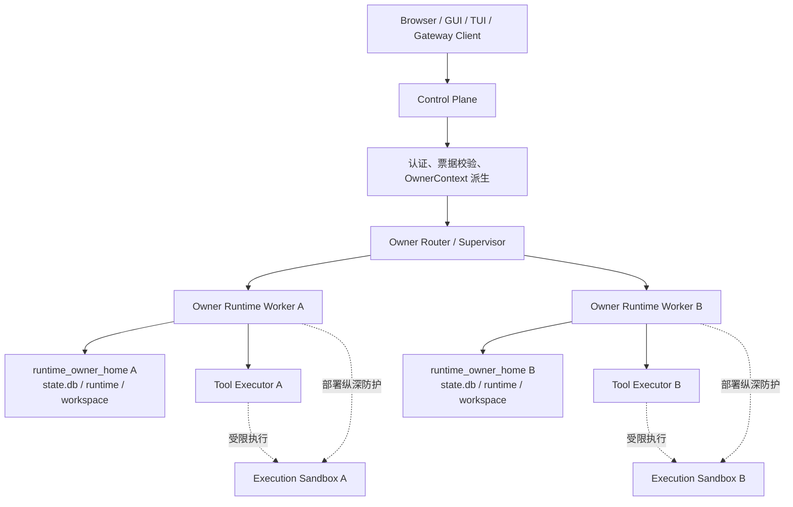

# Hermes 多用户隔离方案：Control Plane、Owner Runtime 与执行沙箱

> 更新时间：2026-07-10
>
> 状态：目标架构、发布基线与实施规范（不是当前全量实现声明）
>
> 相关文档：[Docker 执行沙箱方案](docker.md)
>
> 目标：Dashboard 认证启用后，以当前登录用户的 **owner** 为数据、运行时与执行环境的隔离边界，杜绝 session、live runtime、PTY、memory、skills、workspace 和提示词状态跨用户串用。authenticated 多用户模式仅支持 Linux host 上由 Docker 管理的 per-owner container；在本文明确的 host/runtime 信任假设下，它是本版本支持的 OS 强制隔离基线。gVisor 如启用，仅是该 Docker 容器的 runtime hardening 选项，不代表当前所有生产部署均已采用。

## 0. 执行摘要

多用户隔离不能以“在共享进程的每条路径上传递 `owner_key`”作为最终方案。该方案容易遗漏 cache、全局 map、导入期常量、恢复路径或子进程环境。

推荐的闭环是：

```text
可信登录态 / WS ticket
  -> OwnerContext
  -> Control Plane 鉴权与路由
  -> 每 owner 独立的 Owner Runtime Worker（独立 OS 进程）
  -> 固定 HERMES_HOME=<runtime_owner_home>
  -> owner-local DB、runtime、workspace 与子进程
  -> authenticated 多用户部署强制启用的 OS 级 Execution Sandbox
```

核心决策：

1. 每个 authenticated owner 有独立数据根目录：`<global HERMES_HOME>/users/<owner_key>/`。
2. 每个 owner 由一个独立的 Owner Runtime Worker 服务；一个 worker 绝不服务多个 owner，也不能在运行中切换 owner。
3. Control Plane 仅负责认证、OwnerContext 派生、路由、worker 生命周期和全局资源控制；不直接读取 authenticated owner 的 DB、live state 或提示词状态。
4. Worker 在 import owner-sensitive 模块前固定其运行时视图中的 `HERMES_HOME=<runtime_owner_home>`，因此默认路径、进程内 cache 和子进程环境天然落入 owner scope；该逻辑路径可以是宿主 owner home 的 sandbox mount view，而非宿主绝对路径。
5. HTTP、WebSocket、PTY、resume、Gateway/TUI live state 都必须先按 owner 路由，再执行查找；owner scope 外的数据统一表现为不存在。
6. authenticated 多用户部署仅支持 Linux host 上由 Docker 管理的 per-owner container 作为 OS 强制隔离基线：每个容器必须拥有独立安全主体与独立文件系统视图。该结论依赖受信 Linux host、Docker daemon/runtime、获批准镜像、host-side supervisor 和 deployment profile；它不声称防护内核/daemon 攻陷、容器逃逸或镜像供应链被攻陷。gVisor 如启用，仅是 Docker runtime hardening 选项；微虚拟机、独立 UID/GID + DAC/ACL、独立 mount namespace、裸进程和非 Linux 平台均不是本版本支持路径。仅有独立进程、`HERMES_HOME` 或同一 Unix UID 下的目录约定均不构成充分隔离。
7. Docker Execution Sandbox 是 authenticated 多用户的发布前置条件，提供文件系统、网络与权限的强制边界，但**不能替代** Control Plane 的身份校验和 owner 路由。部署必须提供 host-observed deployment verification record；缺少、陈旧、失配、无法验证或运行时配置漂移时必须拒绝启动/服务，不能降级为共享 UID/shared-home 运行。
8. authenticated 模式与 local / unauthenticated legacy 模式必须有显式分支；legacy 模式不满足多用户强隔离基线，不能与 authenticated 多用户部署混用。owner context 缺失或不一致时 fail closed，不能回退到全局 home。

---

## 1. 威胁模型、目标与不变量

### 1.1 要防止的情况

启用 Dashboard 认证后，必须防止：

- A 读取、搜索、导出、修改或删除 B 的 session、消息、附件或统计数据；
- A 的 resume、latest-descendant、Gateway recovery、mirror 或 channel discovery 恢复 B 的 session；
- 同一浏览器切换 A/B 后复用或互踢 PTY、WebSocket、live session 或 active slot；
- A 的 memory、SOUL、skills、prompt snapshot、agent cache、workspace `CLAUDE.md` 被 B 使用；
- 路径遍历、symlink、bind mount 或导入期缓存使 worker 访问 global home 或其他 owner home；
- 内部 IPC 凭据、前端传入的 `owner_key` / `profile`、容器 ID、同 UID 身份或过期 worker 被当作授权来源；
- 同一 Unix UID/GID 下的 worker 直接读取、列举或打开其他 owner 的 home、runtime、workspace、log 或 checkpoint；
- 检查路径后、实际打开前发生 symlink、rename、mount/bind mount 或 hard-link 替换，导致文件操作越出 owner root；
- 默认网络、DNS、私网、metadata endpoint 或宿主机访问被无意赋予 worker/工具执行器；
- worker 崩溃、回收、重启和审计日志在 owner 间混淆或泄露敏感输入；
- Control Plane 控制 socket、内部 capability、认证私钥、replay state 或 supervisor 元数据被 owner 工具/agent 子进程读取、继承、替换或用于伪装控制面身份；
- 已签发的外部 WS ticket 在过期、logout、身份会话撤销、组织成员资格变化或 reconnect 后仍被错误接受。

### 1.2 信任假设与保护边界

本基线旨在防护跨 owner 的应用缺陷、误共享的 runtime state、不可信浏览器参数，以及 owner workload 中被 prompt、下载内容、工具输入或命令输出操纵的执行行为。它依赖 Linux host、Docker daemon/runtime、获批准镜像供应链、host-side supervisor 和已验证 deployment profile 处于受信状态。

因此，本版本不声称防护恶意宿主管理员、Docker daemon 或内核被攻陷、容器逃逸、获批准镜像被攻陷，或已经被刻意暴露给 owner workload 的密钥被盗用。公网 egress 控制可收缩可达目标，但不能让任意工具行为本身变得可信。Docker container 不是 owner 身份来源，也不能替代 OwnerContext、Control Plane 鉴权或 owner 路由。

### 1.3 本阶段非目标

以下能力应另行设计，不得通过绕过普通用户边界实现：

- 共享 `state.db` 的 row-level 多租户运行时；
- 管理员跨 owner 查询、组织级审计、全局统计或 legacy 数据认领；
- 跨 owner 共享 workspace、文件 ACL 或项目协作；
- 前端全部偏好项的逐 owner 隔离；
- 跨 owner 的全局 session 搜索。

未来需要上述能力时，应建设独立的 Admin Plane，并拥有单独授权和审计，而不是让普通 Control Plane 直接枚举 owner DB。

### 1.4 必须锁住的不变量

```text
authenticated 请求：
  owner 只能由可信 session、可信 WS ticket 或 server-spawn context 派生
  不信任浏览器提交的 owner_key、owner、profile、cwd 或路径根
  OwnerContext 缺失、不一致、过期或 worker 身份不匹配时 fail closed

Control Plane：
  不直接打开 authenticated owner 的 SessionDB
  不维护 owner-sensitive live state、PTY map、prompt cache 或 workspace 解析

Owner Runtime Worker：
  一个独立 OS 进程只服务一个 owner；owner identity 启动后不可变
  HERMES_HOME 必须等于该 owner 的 runtime_owner_home
  DB、sessions index、logs、checkpoint、restart marker、memory、skills 与 workspace 都在 owner scope
  是经 host-side admission 后的 owner-bound Control Plane peer，不以容器、路径或环境变量自身充当身份依据

Tool Executor：
  是 worker 生成、可能受 prompt、下载内容、工具输入或命令输出操纵的受限执行体，不是 Control Plane peer
  只继承任务所需的最小 owner 业务环境、已选 workspace、临时根和 egress profile
  绝不获得 control socket、internal capability、外部 WS ticket、mTLS 私钥、replay state、supervisor metadata、完整 Control Plane 环境或无关 FD
  不可信路径的授权与安全敏感 mutation 必须经过 Safe Filesystem Abstraction；任意 syscall 的最终收缩仍由 executor profile、Docker mount view、身份/FD 隔离和网络执行点保证

执行与生命周期：
  authenticated 多用户 worker/执行器必须运行在 Linux host 的获批准 Docker per-owner container，并具有 host-observed deployment verification record；同 UID、独立进程或 HERMES_HOME 约定均不充分
  worker、容器或沙箱实例绝不跨 owner 复用；同 owner 热复用只能保留在相同安全主体和挂载范围，且须清理临时状态
  egress 必须通过 [Docker 执行沙箱方案](docker.md#5-公网默认可达与受保护目标-egress-例外) 定义的不可绕过执行点和 profile 强制并产生连接级去敏 allow/deny 审计；公共互联网可按 workload 策略允许，但 IPv4/IPv6 loopback、link-local、私网、IPv6 ULA、CGNAT、宿主机/节点、cluster Pod/Service/overlay CIDR、同节点内部服务、metadata、控制面及其内部 DNS/解析路径默认不可达，除非命中获批准的受保护目标例外
  先 owner-scoped resolve，后读取 lineage、prompt snapshot 或 live state
  owner scope 外的数据返回 404 或空结果，而不是“存在但无权限”
```

---

## 2. 三层边界与职责

### 2.1 分层模型



| 层 | 责任 | 不得承担的责任 |
| --- | --- | --- |
| **Control Plane** | 外部认证、OwnerContext 派生、ticket mint/verify、路由、worker 启停与健康检查、全局资源限制 | 读取 authenticated owner DB、解析 live/resume、维护 PTY/browser map、加载 owner prompt/memory/skills |
| **Owner Runtime Worker** | 经 host-side admission 后承载当前 owner 的 API 业务、DB、live session、PTY、Gateway/TUI、memory、skills、workspace，并调度 Tool Executor | 服务其他 owner；运行中变更 `HERMES_HOME` 或 owner identity；将容器、路径或环境变量当身份凭据 |
| **Tool Executor** | 执行模型驱动的工具调用、外部命令、下载、解包、解析或浏览器任务；只使用任务所需 workspace/tmp/egress profile | 认证、授权、owner 路由、control socket、ticket、replay state、supervisor metadata、跨 owner FD/环境继承 |
| **Execution Sandbox** | 以文件系统、网络、capability、资源限额限制 worker 与 Tool Executor | 认证、授权、owner 路由；将“容器存在”视为身份凭据 |
| **Frontend** | browser id 本地分桶、连接清理、UX 提示 | 任何后端授权或 owner 决定 |

### 2.2 Control Plane

Control Plane 必须：

- 从 `request.state.session` 或经签名验证的 WS ticket 派生 `OwnerContext`；
- 只将请求代理到与目标 `owner_key` 匹配、健康且完成握手的 worker；
- 创建/确认 `host_owner_home`、启动/停止/回收 worker，并限制最大 worker 数、启动频率和全局并发；
- 对 owner 缺失、路由不一致、健康检查失败、IPC 断开和 worker 崩溃返回明确错误；
- 对外部 WS 完成认证，然后只做桥接、backpressure 和关闭传播，不解析 owner-sensitive stream 内容。

authenticated 请求下，Control Plane 禁止直接处理 `SessionDB()`、session list/detail/search/export/patch/delete、lineage、resume、PTY map、agent runtime、memory、SOUL、skills、prompt snapshot、owner workspace cwd 或 owner checkpoint。

### 2.3 Owner Runtime Worker

Worker 是 owner-sensitive 数据与运行时的唯一业务边界。它负责：

- session list/detail/search/stats/messages/export/patch/delete/prune；
- lineage、latest-descendant、resume 和 prompt snapshot 的 owner-scoped 解析；
- GUI Chat、TUI、Gateway、live session、active slot、PTY 和 browser bridge；
- memory、SOUL、skills、system prompt、prompt cache、session index、channel directory 和 mirror lookup；
- owner workspace 中的 cwd 解析、任务执行与子进程。

Worker 入口在任何 owner-sensitive import 前固定环境，并在启动时自检：

```text
get_hermes_home() == runtime_owner_home
SessionDB().db_path == runtime_owner_home/state.db
所有 runtime / log / checkpoint / sessions index 路径均位于 runtime_owner_home
```

Worker 只以自身 namespace 中的 `runtime_owner_home` 执行上述自检；它不把宿主路径字符串作为授权或健康证明。任一自检失败即拒绝服务并退出。导入期固定的 `SessionDB.DEFAULT_DB_PATH`、skills path、checkpoint path、sessions index、channel directory 或 mirror cache 必须在 worker 环境已固定后加载，或改为运行时解析。

### 2.4 Execution Sandbox（authenticated 多用户的强制 OS 边界）

Docker 方案、deployment profile 和 egress 拓扑见 [docker.md](docker.md)。authenticated 多用户部署仅支持 Linux host 上由 Docker 管理的 per-owner container；在 [§1.2](#12-信任假设与保护边界) 的信任假设下，Docker Execution Sandbox 是**强制发布前置条件**，不是性能优化或可跳过的可选增强。gVisor 如启用，仅是受批准的 Docker runtime hardening 选项；微虚拟机、独立 UID/GID + DAC/ACL、独立 mount namespace、裸进程、非 Linux 平台或泛化“等效实现”均不是本版本发布路径。Docker 不是 owner 身份来源，也不替代 Control Plane 鉴权、OwnerContext 或 owner 路由。

**Host-observed deployment verification record（宿主观测部署验证记录）** 是由 host-side 受信 supervisor 从 Docker/OCI runtime metadata 生成并在 worker admission 时验证的版本化配置证据，以下简称 **deployment verification record**。它绑定 approved immutable image digest、runtime/manifest profile、container lifecycle identity、`owner_key`/`worker_id`/generation、effective UID/GID、host-observed mount source/target/mode、network/egress profile、rootfs/capability/LSM/tmpfs/resource controls、verifier identity、观测时间/新鲜度和 audit correlation ID。它证明 admission 时 host 所观察到的 Docker 配置及其 owner/worker 绑定；不证明宿主、daemon、内核、镜像行为或运行时不存在未来漏洞。

容器自报、容器内环境变量或路径、worker 提供的 container ID 和浏览器参数只能用于诊断，不能单独建立 owner 身份、挂载归属、profile 合规或授权。Control Plane/supervisor 必须在 worker 接入前将 deployment verification record 绑定到 `owner_key`、worker generation 和容器实例，并在生命周期变化时重新检查；记录缺少、陈旧、失配、无法验证或配置漂移时，authenticated 多用户模式必须 fail closed、摘流或停止实例，并记录 record ID/version 与拒绝原因的去敏审计。

独立 Worker 进程、`HERMES_HOME`、目录命名或共享 Unix UID/GID 都不是充分隔离边界：同 UID 进程仍可能直接打开另一个 owner 的绝对路径。若没有获批准的 deployment verification record，Control Plane 必须拒绝 authenticated 多用户请求，而不得降级运行。

Docker container 必须满足：

- 每个 Docker container 绑定一个 owner，**绝不跨 owner 放回共享池**；同 owner 热复用也只能发生在相同 owner、安全主体、deployment verification record 和挂载范围内。
- owner runtime 以独立有效安全主体运行，且只能看见自己的 `host_owner_home` 对应的 `runtime_owner_home`、所需的只读全局资源和受限临时目录；不得挂载父级 `users/` 目录、其他 owner home 或任何可写全局目录。
- owner-local 可写目录仅挂载到该 owner 的 sandbox；全局 skills、模板和公共知识库仅以只读方式挂载。
- 根文件系统只读，临时目录为大小受限的 tmpfs；丢弃 Linux capabilities，启用 `no-new-privileges` 和受限 syscall/capability 策略或等价控制；以非 root 用户运行。
- 禁止 privileged mode、host network、host PID/IPC、Docker/container runtime socket、宿主 `/proc`/`/sys`、设备节点、任意 host bind mount 或其他能越过 owner 文件视图的集成。
- 容器/沙箱退出后临时目录、socket、残留进程和非持久中间态必须清理；持久化数据只能落在 owner-local persistent mount。

网络执行点、`control-only` / `owner-public` / `tool-none` / `tool-public` / `protected-target` profile、默认拒绝集合、DNS/连接双重校验与 egress 审计由 [Docker egress 方案](docker.md#5-公网默认可达与受保护目标-egress-例外) 权威定义。Control Plane、Worker 和 Tool Executor 只能使用其角色/任务获批准的 profile；应用代码或 hostname 比较不能替代该执行点。

沙箱不能修复错误的 owner 推导、错误路由或错误的 Control Plane 授权；它负责在应用层发生遗漏时强制收缩文件系统、进程、权限和网络的爆炸半径。

---

## 3. 身份、命名与存储边界

### 3.1 路径视图与统一术语

同一 owner 的持久化路径与 worker/sandbox 内可见路径必须分开命名；它们通过受信部署的挂载契约关联，不能彼此替代为授权输入：

| 名称 | 含义 | 可作为授权输入？ |
| --- | --- | --- |
| `host_global_home` | Control Plane 所在宿主/受信 supervisor 管理的全局持久化根 | 否；仅用于受控部署和持久化管理 |
| `host_owner_home` | 宿主持久化目录 `<host_global_home>/users/<owner_key>` | 否；只能由 Control Plane 依据 `OwnerContext` 选择 |
| `runtime_owner_home` | Worker 自身 namespace 中的逻辑 owner 根，也是其 `HERMES_HOME` | 否；仅可由已验证 profile 的 mount 契约决定 |
| sandbox mount view | 例如把 `host_owner_home` 映射为 `/owner`、只读全局资源映射为 `/global` 的 runtime 路径 | 否；路径字符串或容器回报均不能单独证明 owner 身份 |

Control Plane 只比较不可变 owner identity、worker generation、已验证 profile 与预期挂载契约；Worker 只验证其 `HERMES_HOME` 和实际打开的 DB/runtime/workspace 均受限于 `runtime_owner_home`。不得要求或依赖容器内路径与宿主绝对路径字符串相等。

| 字段 | 来源与稳定性 | 用途 | 不可用于 |
| --- | --- | --- | --- |
| `auth_provider` | 可信 session 的 provider | 区分身份命名空间 | 前端自行声明 |
| `owner_user_id` | 可信 session 的 `user_id` | owner 身份材料 | 前端路径或 DB 选择 |
| `tenant_id` | 优先可信 `org_id`；无组织时使用已定义的稳定个人 tenant 规则 | 组织/个人租户边界 | 由前端任意覆盖 |
| `owner_key` | 服务端 secret 对 provider、tenant、user 派生 | 路由键、目录名、受控显示与本地分桶 | 后端授权输入 |
| `owner_home`（旧泛称） | 规范中不再单独使用；按位置改为 `host_owner_home` 或 `runtime_owner_home` | 仅用于迁移旧表述 | 作为未区分宿主/运行时的授权或路径输入 |

`owner_key` 表示可信 `(auth_provider, tenant_id, owner_user_id)` principal，而不只是裸 user。`tenant_id` 存在时必须来自可信组织 scope；无组织时使用唯一、固定的个人 tenant 规则。个人 tenant 的 canonical 规则必须在认证实现中固定，并在 HTTP、WS、token 刷新和 worker spawn 使用同一个派生函数。否则同一登录态会被路由到不同 owner home。成员退出、tenant 切换、密钥轮换、数据保留、迁移或删除必须走独立的受控管理/迁移流程，不能由前端参数、logout 或普通 worker 生命周期隐式完成。

### 3.2 OwnerContext 与 owner_key

建议由唯一模块提供不可变上下文：

```python
@dataclass(frozen=True)
class OwnerContext:
    auth_provider: str
    tenant_id: str
    owner_user_id: str
    owner_key: str
    host_owner_home: Path
```

`owner_key` 使用服务端 secret 的版本化 HMAC 派生，例如：

```text
owner_key = "ok1_" + base32url(
  HMAC-SHA256(secret, provider + "\0" + tenant_id + "\0" + user_id)
)[0:32]
```

要求：

- secret 只来自受控环境变量或 global home 内首次生成且受保护的文件；必须备份；
- `owner_key` 不可逆、不可预测且文件系统安全；
- 轮换必须通过版本前缀与显式迁移进行，secret 丢失或静默轮换会导致用户进入新 home，属于事故；
- `/api/auth/me` 可以返回最小 owner public summary 供前端分桶，但每个请求仍必须从可信身份重新派生 owner；
- WS ticket 必须带足够的已签名/加密身份材料，保证其派生结果与 HTTP 完全一致。浏览器 query 中的 owner 字段不可信。

### 3.3 目录与数据分类

```text
<host_global_home>/
  control-plane/
    owner_secret
    runtime/
      supervisor/             # supervisor lock、worker registry
      worker-control/         # control-only IPC、replay state、认证材料；不挂载给工具/agent 子进程
    logs/                     # 仅控制面日志，不能记录 owner prompt/content

  users/
    <owner_key>/              # host_owner_home
      state.db
      memories/
      memory_store.db
      SOUL.md
      skills/
      sessions/               # owner-local runtime index
      runtime/
        business/             # owner-local 业务 socket / pid / logs；不能承载控制面认证
        checkpoints/
        restart-marker
      workspaces/
        default/
      persistent/             # 用户上传与持久产物（如启用）
```

- Control Plane 只保存全局 secret、supervisor 元数据和控制面日志；owner-sensitive 文件只能进入对应 `users/<owner_key>/`。`worker-control/` 是 control-only 区域，不得挂载或暴露给 owner 工具/agent 子进程；owner-local `runtime/business/` 若存在 socket，只能承担 owner 业务通信，不能承担 Control Plane 控制认证。
- Control Plane 必须在首次 authenticated 使用或受控 bootstrap 时，以不跟随链接的原子方式创建/确认 `host_owner_home`，并验证父目录所有权、目标 inode/mount source、权限和预期安全主体。owner home 在 logout 后保留；删除、数据保留期变更、迁移和 secret 轮换只能由独立受控管理流程执行。
- `profile` 是本地多实例/配置概念，不是授权边界。authenticated 第一版应拒绝外部 `profile`，或将它解析为 `<runtime_owner_home>/profiles/<profile>/...` 内的 owner-local 子命名空间；不得用它选择任意 DB/home。
- legacy/global 数据不应在 authenticated 请求中隐式读取。导入、claim、合并与回滚必须作为独立迁移工具和流程设计。

### 3.4 Safe Filesystem Abstraction 与 Workspace Compatibility Layer

所有不可信 owner-relative 路径的授权与安全敏感文件 mutation（不仅是 workspace）必须经 **Safe Filesystem Abstraction**：一套从受控 root directory FD 出发、descriptor-relative 且抗 TOCTOU 的规范性协议。`realpath()` / `resolve()` 只能用于诊断或防御性检查，不能采用“先按路径校验 containment，之后再以路径字符串 `open` / `mkdir` / `rename` / `delete`”的模式；在两步之间，攻击者可通过 symlink、rename 或 mount 替换目标。

协议要求：

1. 不信任前端传入的 owner、根路径、绝对路径或 cwd；允许根只能由 `OwnerContext` 得出，并由已验证 deployment verification record 对应的 owner-only mount / 权限边界强制实施。
2. 从预先安全打开的允许根目录 FD 出发，仅接受相对路径，逐层解析并操作；拒绝空路径、绝对路径、`..`、symlink、magic link、跨设备/mount 逃逸和未明确允许的文件类型。
3. authenticated 多用户隔离仅支持 Linux host 和 Docker container；Linux 上优先使用 `openat2` 及 `RESOLVE_BENEATH`、`RESOLVE_NO_SYMLINKS`、`RESOLVE_NO_MAGICLINKS` 和按根边界需要的 `RESOLVE_NO_XDEV`；无 `openat2` 的 Linux 环境使用根目录 FD 下逐段 `openat` / `dir_fd`、`O_NOFOLLOW`、目录类型检查和 `fstat` 复核。其他平台不属于该模式的受支持发布平台。
4. 创建、替换、rename、删除、解包、上传/下载、socket、日志、checkpoint、临时文件与子进程 cwd 都必须使用同一受控目录 FD 的 `*at` 或等价原子操作；写入临时文件也必须在同一安全根下创建，完成后不得重新按不可信路径解析。
5. hard link、rename race 与 bind mount 风险不能只靠 canonical path 消除；必须结合 descriptor-relative API、受控挂载拓扑、独立安全主体，以及禁止在 owner 可写根引入外部链接的策略共同防护。
6. 写入根、只读全局根和临时根分别显式列出；默认拒绝其他位置。对实际打开后的对象仍应按 FD 的类型、device/inode 或等价约束进行复核。

#### Workspace Compatibility Layer

workspace 是 Safe Filesystem Abstraction 选定的受限用途视图，不是授权边界。兼容层可在安全选定 workspace 后向既有项目工具、`cwd`、`CLAUDE.md` 和 child process 提供常规的逻辑路径，但不能把一次验证的路径字符串重新作为后续授权输入。

authenticated workspace 仅允许在：

```text
<runtime_owner_home>/workspaces/
```

默认 cwd 为 `workspaces/default`。不在该根下的 cwd 必须通过上述安全打开协议拒绝，不能静默回退；否则会加载其他用户项目中的 `CLAUDE.md`、memory 或上下文。已由安全边界选定的 app-owned 路径可继续使用常规 path-oriented API；不可信输入、路径授权和安全敏感 mutation 仍必须经过 Safe Filesystem Abstraction。该兼容层不授权任意 host 路径、共享 workspace 或 executor-visible owner parent directory；Docker mount view 必须使 Tool Executor 直接发起的 syscall 逃逸尝试同样无效。

---

## 4. 路由、IPC 与请求语义

### 4.1 Worker 启动与握手

启动顺序：

1. Control Plane 校验 session/ticket 并派生 `OwnerContext`；
2. 以受控、原子和不跟随链接的方式创建/确认 `host_owner_home`，验证其所有权、权限和预期 mount source；
3. 由 host-side 受信 supervisor 以 approved Docker image/configuration 启动 owner-bound container，读取 Docker/OCI runtime metadata 并生成/验证 deployment verification record 与挂载契约；worker 最少接收 `HERMES_HOME=<runtime_owner_home>`、`HERMES_OWNER_KEY`、`HERMES_TENANT_ID`、`HERMES_OWNER_USER_ID`、`HERMES_AUTH_PROVIDER` 和 `HERMES_WORKSPACE_ROOT`，而非完整 Control Plane 环境；
4. Worker 完成路径自检，返回 immutable owner identity、worker generation、runtime path summary、deployment verification record ID/version 与 ready 状态；该回报仅作诊断一致性信号；
5. Control Plane 依据 supervisor 的 deployment verification record 校验 `owner_key`、generation、image digest、container lifecycle identity、mount/security/network 契约和 `runtime_owner_home` 均符合预期，才允许代理请求。不得比较或信任容器回报的宿主绝对路径字符串、容器内环境变量或 container ID。

推荐 IPC 为权限受限的 Unix domain socket；也可使用 stdio JSON-RPC 或 mTLS 保护的 loopback。Control Plane ↔ Worker 控制 IPC、内部 capability、mTLS 私钥和 replay state 必须位于 control-only 区域，独立于 owner 可写业务 runtime，且不对工具/agent 子进程可见、可写或可继承。无论采用何种传输，Control Plane 签发的内部 capability 是唯一的 owner 授权材料；socket 路径、loopback 来源、环境变量、容器 ID 或浏览器参数都不能单独代表 owner。

内部 capability/token 必须由 Control Plane 签发并可由目标 worker 验证，至少包含：

```text
iss / signing-key-version
owner_key（及可验证的 tenant/provider/user 派生绑定）
aud = worker_id + worker_generation + owner_key
scope = 被允许的 RPC/route 类别
protocol_version
issued_at / expires_at（极短有效期）
jti（唯一标识）
```

要求：

- `aud` 必须精确绑定目标 worker 实例、其 generation 和 owner，不能是泛化的 `internal-worker`；worker 重启或 generation 改变后，旧 audience/capability 立即失效。
- 启动握手 capability 只能使用一次。Control Plane/supervisor 在 host-side control-only 区域维护唯一权威 replay store，以 `token_class + iss/key-version + jti + exact_audience` 命名空间执行原子 check-and-consume-until-expiry；消费必须发生在接纳 worker bootstrap/control connection 前。worker 只验证签名、owner/generation/audience/scope 和传输绑定，并接收 admission 成功后的 connection-bound context；不得独立决定 `jti` 是否新鲜或保留跨重启的权威副本。replay store 不可用、重复 `jti`、错误 issuer、错误 owner/audience/scope、过期或格式不符的 capability 必须 fail closed 并产生去敏安全审计。
- 握手后的每个请求绑定已认证连接，并使用连接随机 nonce + 单调递增序号、消息认证或等价机制，防止有效 capability 在另一个连接重放，或重复执行非幂等请求。worker/container 重启必须递增 generation、关闭旧控制连接、废止旧 audience/capability、重新生成 deployment verification record 并 mint 新 capability；旧 generation `jti` 不可迁移。若 Control Plane/supervisor 重启后无法可信恢复 replay store，则所有未消费 capability/ticket 必须失效并要求重新认证/re-mint，不得仅凭有效签名和未过期时间接纳。
- Unix socket 的父目录与 socket 必须位于 control-only 区域、由独立安全主体以最小权限拥有，并校验对端 OS credential；仅靠共享 UID 下的 socket mode 不合格。若使用 loopback TCP，双方必须使用 mTLS 并验证对端证书链与目标 audience；仅监听 `127.0.0.1` 不构成认证。
- 外部 WS ticket 只用于 Control Plane 的外部认证，是短期、single-use 的 bearer credential，至少包含可得出与 HTTP 一致 `OwnerContext` 的可信 principal 材料、issuer/key version、protocol version、唯一 `jti`、短 `exp` 和 exact audience。audience 必须绑定预期的 public WS entrypoint 与 route/protocol class；Dashboard WS ticket 不得用于 PTY WS、其他公开 endpoint、Worker、内部 IPC 或工具进程。Control Plane 在完成 WS upgrade/bridge 前验证身份会话、撤销/成员资格、owner 派生与 exact audience，并通过权威 replay store 原子消费 `jti`；成功或竞争消费后所有副本/重试均失败。reconnect、新浏览器连接或 retry 必须重新经 Control Plane 认证并 mint 新 ticket；ticket 永不转发 Worker。logout、tenant 切换、session/membership revoke、expiry、audience mismatch、replay 或 replay-store 不可用必须 fail closed 并审计；浏览器不得直接连接 worker。
- owner 不匹配、异常传输身份或 capability 验证失败时拒绝请求、记录安全事件，并隔离/停止被错误路由的 worker。

### 4.2 HTTP 与 WebSocket

```text
Client HTTP / WS
  -> Control Plane：认证、派生 owner、获取或启动健康 worker
  -> Owner Worker：校验内部 owner-bound 请求、执行 owner-local 操作
  -> Control Plane：透传结果 / 桥接流
```

- 所有 authenticated session API、session detail/message/export、patch/delete/prune、lineage、resume、Gateway/TUI 与 PTY 都路由至 owner worker。
- session id、短 id、title、resume id 或 browser id 的查找必须在 worker 内的 owner DB/owner live state 进行。找不到返回 404 或空结果，不能先全局查找再鉴权。
- `/api/profiles/sessions` 这类跨 profile 聚合接口在 authenticated 第一版应返回 404/403，或只由 worker 提供 owner-local 视图；Control Plane 不得枚举 profile DB 或 owner DB。
- 外部 WS ticket 只由 Control Plane 校验。Worker 仅接受内部 WS/IPC；Control Plane 负责双向 backpressure、client/worker/control-plane 关闭传播和超时错误传播。
- logout、用户/tenant 切换、身份会话撤销或成员资格失效时关闭旧 owner 的外部 WS/PTY、取消旧 reconnect；worker 根据会话策略清理该 owner 的临时 bridge。上述动作不删除 owner home 中的持久数据。

### 4.3 前端约束

前端仅用于降低浏览器复用风险：

```text
local / unauthenticated: hermes.dashboard.browser_id
authenticated:            hermes.dashboard.browser_id:<owner_key>
```

同一 owner 刷新可复用 browser id；不同 owner 必须获取不同 id。`owner_key`、`profile`、`browser_id`、`resume` 和 cwd 都只是 UX hint；唯一授权依据是后端从可信 session/ticket 派生出的 OwnerContext。

---

## 5. Runtime、沙箱与生命周期

### 5.1 owner-local runtime

由于 worker 是单 owner 进程，下列索引必须只存在于其 owner scope：

```text
browser_id -> PTY session
session_key -> live session
active_slot -> live session metadata
prompt_cache_key -> prompt snapshot
sessions.json -> gateway routing index
channel directory / aliases
mirror lookup index
```

仍建议在持久化 metadata 中记录 `owner_key`，用于日志、启动自检和防御性断言。未来若错误地把状态移回共享进程，owner mismatch 应被直接当作不存在并触发安全日志。

### 5.2 子进程与受限执行

- Worker spawn 的 Tool Executor 必须显式继承最小化的 `HERMES_HOME=<runtime_owner_home>` 业务环境，不能依赖调用方的全局环境；继承的 cwd、打开 FD、环境变量、临时目录和挂载视图也必须属于当前 owner 的已验证 Docker container。Tool Executor 不是 Control Plane peer：必须显式关闭或不继承无关 FD，且不得得到内部 capability、外部 WS ticket、控制 socket、mTLS 私钥、replay state、supervisor 元数据或完整 Control Plane 环境。
- 只读全局资源、owner 可写持久目录和临时目录必须分离挂载或分离配置。所有文件输入、输出、解包、日志、checkpoint 和 cwd 设置都遵循 [Safe Filesystem Abstraction](#34-safe-filesystem-abstraction-与-workspace-compatibility-layer)，不得通过检查后的路径字符串再次打开。
- 临时数据优先放入受大小限制的 tmpfs 或 owner-local temporary root；任务/容器退出后清理临时文件、socket、已打开资源与残留进程。
- 无网络 Tool Executor 必须使用 `tool-none` profile，不得继承联网 worker 的 egress capability。需要公网的 worker 使用 `owner-public`，有明确公网任务需求的 Tool Executor 使用独立的 `tool-public`；受保护目标或额外收紧范围只通过 `protected-target` profile。profile 的强制执行点、DNS/连接校验、默认拒绝集合与审计语义以 [Docker egress 方案](docker.md#5-公网默认可达与受保护目标-egress-例外) 为准。
- 不应把 `docker.md` 中为受限工具执行设计的狭窄命令白名单，直接当成所有 Hermes agent 行为的无条件限制。任何命令允许策略须按实际工具能力、输入验证、`shell=False`、运行身份和沙箱策略单独评审。
- 不允许 `shell=True` 拼接不可信输入；命令与参数应结构化传递并校验。

### 5.3 资源、回收与故障

Control Plane 至少需要：最大 worker 数、每 owner 最大并发、idle timeout、启动频率限制、每 worker 内存/进程/PTY 限额，以及仅针对 idle worker 的全局 LRU eviction。

- worker 空闲可退出；崩溃可按需以同一个 OwnerContext 重启；live state 丢失可以接受，但不得恢复其他 owner 的 state。
- 不得为降低冷启动而跨 owner 复用 worker、容器、PTY、进程、tmpfs 或 in-memory cache。
- worker/沙箱退出时删除临时 socket、临时目录和非持久中间态；保留的数据仍必须在对应 `host_owner_home` 内。Control Plane control-only IPC、认证材料和 replay state 不得转入 owner runtime 或任何工具进程。
- pending HTTP/WS 必须得到明确的 worker-start timeout、health mismatch、IPC 断线或 crash 错误，不能被悄悄路由到 legacy/global runtime。

### 5.4 审计与隐私

为隔离故障排查建立结构化审计记录，至少包含：

```text
timestamp | event_type | owner_key_digest | worker_id/container_id |
route/action | target_class | outcome | failure_reason | request/correlation_id
```

要求：

- 使用截断哈希或受控摘要标识 owner，避免在常规日志暴露原始 user id、ticket 或 email；
- 不记录 prompt、会话正文、文件内容、token/capability、完整命令参数、Authorization header 或请求体，除非有单独的受控审计策略；
- 记录 worker/container 创建、deployment verification record ID/version 验证或配置漂移、握手失败、owner mismatch、capability issuer/audience/scope/replay consume/reject、replay-store restore failure、generation rollover/restart invalidation、异常传输身份、路径拒绝、Docker 策略例外、路由失败、回收、崩溃和重启；
- 不可绕过的网络执行点必须为全部 egress 产生连接级去敏 allow/deny 审计；受保护目标还记录策略 ID/版本、owner 摘要、worker/container、workload/批准用途、目标类别或域名摘要、端口、结果、拒绝原因与 correlation ID；策略变更、临时例外和到期撤销也必须审计。
- admin/audit 查询必须走独立权限与审计路径。

---

## 6. 实施顺序

实现可以分提交，但 authenticated 对外上线前必须满足完整边界。以下不是可接受的中间上线形态：只在前端或 `/api/auth/me` 暴露 `owner_key`，但仍由共享 Control Plane 读 DB、维护 PTY 或解析 resume；或 owner context 缺失时回退 global home。

### Phase 0：身份与进程基础

1. 建立唯一 `OwnerContext` 派生模块，固定个人 tenant 规则与 HMAC owner key；
2. 持久化、备份 owner secret，并定义版本与轮换迁移；
3. 实现 `host_owner_home` 的安全创建、host-observed deployment verification record 生成/验证、worker 最小化 env、独立 Docker container worker 入口、健康检查和 owner-bound IPC 握手；
4. `/api/auth/me` 和短期、single-use、exact-audience 外部 WS ticket 共享同一 owner 派生与撤销语义；
5. 明确 Docker-only authenticated 模式的 profile 策略，以及 Control Plane host-side control-only 区域不向容器/工具进程挂载或继承的规则。

**验收：** 同一登录态在 HTTP、WS、worker spawn 得到同一 owner key；worker 的 `HERMES_HOME` 等于其 `runtime_owner_home`，并由 host-observed deployment verification record 的 mount 契约映射到预期 `host_owner_home`；不存在同进程 ContextVar/env mutation 多 owner 模式；重启后 owner key 稳定；authenticated 多用户模式若 deployment verification record 缺失、陈旧、无法验证或发现失配/漂移则拒绝启动/服务；同一宿主机 UID 下的 A/B runtime 也不能列举、读取或打开对方 owner home。

### Phase 1：session API 的 Control Plane / Worker 分离

1. authenticated session handler 改为 Control Plane proxy；
2. session DB 业务、lineage 与 latest-descendant 迁入 worker；
3. 禁止 authenticated Control Plane 直接打开 `SessionDB()`；
4. 禁用或 owner-local 化跨 profile 聚合。

**验收：** A/B 由不同 worker 与不同 `state.db` 服务；全局 DB sentinel 不会被 authenticated 请求读取；A 无法枚举、检索、导出、更新或删除 B 的 session；local legacy 行为不变。

### Phase 2：WS、PTY、frontend 连接边界

1. 外部 WS 在 Control Plane 认证后桥接给 worker；
2. PTY/browser map 和 internal WS 权限迁入 worker；
3. browser id 按 owner 分桶，logout/user switch 清理旧连接；
4. 覆盖 backpressure、worker cold start、crash、IPC timeout 与 close propagation。

**验收：** 同一浏览器切换 A/B 连接不同 worker，不互踢、不复用 PTY；外部 WS ticket 由 Control Plane 按 exact audience 原子单次消费，竞争副本/重试必须失败且 reconnect 重新 mint；内部凭据无法脱离 owner claims 访问 worker；host-side 权威 replay store 拒绝错误 issuer、owner、worker generation/audience、scope、过期 token、重复 `jti`、跨连接重放、序号回退和不合规 UDS peer/mTLS 身份并审计；worker/container 重启后旧 capability 立即失效，replay store 无法可信恢复时 outstanding token fail closed。

### Phase 3：Gateway、TUI、resume 与运行时索引

1. Gateway/TUI 由 owner worker 运行或 spawn；
2. sessions index、active slot、live lookup、peer recovery、channel directory 与 mirror 进入 owner scope；
3. 为持久化 runtime metadata 增加 owner 断言；
4. 先 owner-scoped resolve，再读取 prompt snapshot、lineage 或 live state。

**验收：** 相同 platform/chat/thread 但不同 owner 不会复用 session；stale sessions index、mirror 和 recovery 无法跨 owner；外部 resume B 的链接对 A 表现为不存在。

### Phase 4：路径、子进程与部署纵深防护

1. 修复主链路中的 import-time path cache，使其在 worker home 中初始化或动态解析；
2. 对 workspace 和全部 owner-local 文件入口实施 [Safe Filesystem Abstraction](#34-safe-filesystem-abstraction-与-workspace-compatibility-layer)；禁止仅 canonical/realpath containment 后再按路径操作；
3. 显式向 Tool Executor 传递最小化 owner 业务环境，并阻止跨 owner cwd、FD、临时目录、环境变量和挂载视图继承；尤其禁止继承 Control Plane IPC、capability、ticket、认证私钥、replay state 与 supervisor 元数据；
4. 按 [Docker 执行沙箱方案](docker.md) 的 deployment profile、deployment verification record、owner-only mounts、只读全局资源、只读根、非 root、受限临时目录和 capability/syscall 收敛实施 Docker per-owner container；gVisor 如启用仅作为 Docker runtime hardening；
5. 使用 `owner-public`、`tool-none`、`tool-public` 与 `protected-target` egress profile，由强制 gateway/proxy 和获批准 DNS 路径实施“公网按策略允许、内部敏感目标拒绝”的网络边界；
6. 落实由 Control Plane/supervisor 权威 replay store 执行的 IPC capability/WS ticket generation、atomic consume、transport 验证、审计、回收与资源限制。

**验收：** A/B 的 prompt、memory、SOUL、skills 与 Tool Executor 路径完全分离；在 symlink/rename race、bind mount、hard-link、解包与“检查后替换目标”测试下，cwd/文件操作均无法逃逸安全根；实现证明使用 Linux FD-relative/openat2 或 openat 原子协议，而非仅 `realpath` 检查；Docker container 启动、退出、deployment verification record 验证失败与异常过程均有去敏审计；经 Docker egress topology 的强制执行点验证，公共互联网与允许的公网 DNS 解析可达并产生 allow/deny 审计，而 IPv4/IPv6 loopback、host/节点、私网、ULA、CGNAT、cluster CIDR、metadata、控制面及内部 DNS 路径仍不可达；受保护目标例外只能经 `protected-target` profile 的获批准 egress proxy 访问指定目标，且 IP 直连、DNS rebinding、SNI 不匹配与相邻域名访问均失败并记录。

---

## 7. 验收清单

### 7.1 边界与身份

- [ ] OwnerContext 只能从可信 session、可信 ticket 或 server-spawn context 派生；
- [ ] HTTP、WS 和 worker spawn 的 owner 结果一致；
- [ ] secret 可恢复、owner key 已版本化；
- [ ] owner context 缺失/不一致时 fail closed，不回退 global home；
- [ ] Worker health 的 owner key、generation、`runtime_owner_home` 与预期一致，且其 `host_owner_home -> runtime_owner_home` 映射仅由 deployment verification record 的 mount evidence 证明；不依赖容器内外绝对路径字符串、容器环境变量或容器自报 ID；
- [ ] authenticated 多用户部署仅在 Linux host 使用 Docker per-owner container；deployment verification record 缺失、无法验证、陈旧、失配或配置漂移时拒绝启动/服务，不降级为共享 UID/shared-home 运行；record ID/version、image digest、container/generation 绑定和拒绝原因产生去敏审计；
- [ ] A/B 即使运行在同一宿主机 UID 下，也不能列举、读取、打开或通过绝对路径访问对方的 DB、runtime、workspace、log、checkpoint 或 socket；
- [ ] 每个 owner runtime 的安全主体、可见挂载和可写目录均只对应其 owner；不存在 privileged/host namespace/Docker socket/父级 users 目录等越权集成。

### 7.2 DB、API 与恢复

- [ ] authenticated Control Plane 不读 owner `SessionDB`；
- [ ] A/B 的 `state.db`、session API、search、export、patch、delete、prune 和 stats 相互隔离；
- [ ] cross-owner session id、短 id、title、resume id、latest-descendant 和 prompt snapshot 均不可见；
- [ ] authenticated `/api/profiles/sessions` 不枚举全局 profile/owner DB；
- [ ] local / unauthenticated 的 legacy 路径仍显式可用且不被 owner runtime 混用。

### 7.3 WS、PTY 与 live runtime

- [ ] 外部 WS ticket 仅由 Control Plane 消费，是短期、single-use、exact-audience-bound 的 bearer credential；在 WS upgrade 前由 host-side 权威 replay store 原子消费，竞争副本/重试失败且 ticket 永不转发 Worker；过期、logout、session/成员资格撤销、tenant 切换、audience mismatch 或 replay-store 不可用时被拒绝，reconnect/new connection/retry 必须重新认证并 mint 新 ticket，之后才桥接到正确 worker；
- [ ] worker-local PTY/browser map、active slot、live session 与 sessions index 无跨 owner 引用；
- [ ] internal IPC/WS 同时验证内部通道和 owner-bound claims；capability 包含 issuer/key version、owner、worker generation audience、scope、短 `exp`、`jti` 与协议版本；
- [ ] host-side 权威 replay store 对 `token_class + issuer/key-version + jti + exact_audience` 原子消费；错误 issuer、owner、audience、scope、过期 token、已消费 `jti`、跨连接重放和消息序号回退均 fail closed 并进入去敏审计；worker/container restart/generation 变化立即废止旧 capability，replay store 无法可信恢复时 outstanding capability/ticket 失效；
- [ ] UDS control IPC 位于工具不可见的 control-only 区域并校验最小权限与 peer credential；loopback TCP 使用并验证 mTLS，不能把 loopback、socket path、容器 ID、环境变量或浏览器 ticket 当作 owner 授权；
- [ ] logout/user switch、client close、worker crash、Control Plane shutdown 都正确关闭并清理连接；
- [ ] Gateway recovery、channel directory、mirror 与 TUI resume 仅查询当前 owner scope。

### 7.4 文件、子进程与沙箱

- [ ] [Safe Filesystem Abstraction](#34-safe-filesystem-abstraction-与-workspace-compatibility-layer) 覆盖所有 owner-local 文件类操作：从受控根目录 FD 出发，使用 `openat2`/`openat` + no-follow 或等价的 descriptor-relative 原子协议；不允许仅 `realpath`/字符串前缀检查后再按路径操作；
- [ ] symlink/`..`/magic link/rename race/bind mount/hard-link/解包与“检查后替换目标”逃逸均被拒绝，且实际打开对象经 FD 类型、device/inode 或等价条件复核；Workspace Compatibility Layer 仅为安全选定的 `<runtime_owner_home>/workspaces/` 提供 cwd/项目工具视图；
- [ ] Tool Executor 显式带最小化 owner `HERMES_HOME`，且不继承跨 owner cwd、FD、临时目录、环境变量或挂载视图；不获得 Control Plane IPC、内部 capability、WS ticket、认证私钥、replay state 或 supervisor 元数据；
- [ ] import-time cache 不会绑定 global home；
- [ ] authenticated 多用户仅使用 deployment verification record 验证的 Docker per-owner container，且不跨 owner 复用；owner 可写、全局只读、临时目录分离；根只读、非 root、capability/syscall 收敛，且无 privileged、host namespace、runtime socket、宿主机设备或危险 host mount；
- [ ] 按 [Docker egress 方案](docker.md#5-公网默认可达与受保护目标-egress-例外) 的强制 gateway/proxy 和 profile 验证：`owner-public`/`tool-public` 仅能经允许 DNS 访问支持的公网协议，`tool-none` 无网络，全部 egress 产生连接级去敏 allow/deny 审计；IPv4/IPv6 loopback、link-local、私网、IPv6 ULA、CGNAT、host/节点、cluster CIDR、metadata、控制面及内部 DNS/解析路径默认不可达；
- [ ] `protected-target` 仅对绑定 owner/workload/purpose/策略版本/有效期的 workload 生效，并经受控 proxy/allowlist 限制 FQDN/SNI、端口、协议、DNS 与证书；IP 直连、DNS rebinding、SNI 不匹配和非批准目标均失败；受保护目标或更宽网络授权不自动传递给 Tool Executor；每个 allow/deny、策略变更和到期撤销均有去敏审计。

### 7.5 生命周期与审计

- [ ] idle 回收、crash 重启、LRU eviction 不迁移/复用其他 owner 的 runtime state；
- [ ] worker、checkpoint、restart marker、logs 和 owner 业务 socket 处于正确 owner scope；Control Plane control IPC、认证材料和 replay state 处于独立 control-only 区域且工具进程不可见；
- [ ] owner home 的安全创建、logout 后保留、受控迁移/删除与 key rotation 均具备可测试生命周期规则；关键安全事件产生去敏结构化审计记录；
- [ ] 审计日志不含 prompt、会话正文、ticket/token 或未授权文件内容。

---

## 附录 A：2026-07-08 代码快照（非长期规范）

本附录记录原始方案评审时识别的重点改造区域，用于实施排期；具体行号会随代码演进失效，不能替代本文件中的边界规则。

| 范畴 | 当时观察到的风险 / 需要确认的方向 |
| --- | --- |
| Web session API | handler 直接打开默认或 profile DB；authenticated 下应成为 worker proxy。 |
| `SessionDB` | 默认 DB 路径可能在 import 期固定；worker 必须在固定 owner env 后加载或改为动态解析。 |
| Dashboard auth / WS ticket | session 已含 user/provider/org 等身份材料；`/api/auth/me` 与 ticket 需统一输出/携带 owner 派生材料。 |
| Gateway / TUI | `SessionSource`、session key、active slot、resume 和 peer recovery 需要 owner-local 运行或 owner metadata 断言。 |
| PTY / frontend | 浏览器 id 曾使用全局 localStorage key；PTY map 不应留在共享 web server。 |
| Runtime path caches | `run_agent`、gateway、TUI、skills、process registry、checkpoint、platform cache、channel directory 和 mirror 等顶层路径常量需要按 worker env 审计。 |

实施时应通过当前代码搜索与测试确认实际入口，而不是依赖本文旧行号。

---

## 最终建议

Hermes 的多用户隔离应遵循：

```text
认证和路由可以共享；
owner 数据、live state、PTY、prompt、memory、skills、workspace、进程环境与沙箱实例不能共享。
```

Control Plane 的正确职责是识别 owner 并把请求交给正确的单 owner Worker；Worker 的正确职责是让默认运行时只看见自己的 `HERMES_HOME` 并调度受限 Tool Executor；Execution Sandbox 则进一步确保即使应用代码或执行器行为出现缺口，也只能接触当前 owner 的受限资源。三层同时成立，才能把“多处都记得加 owner 参数”的脆弱约定，收敛为可验证、可运维的系统边界。
